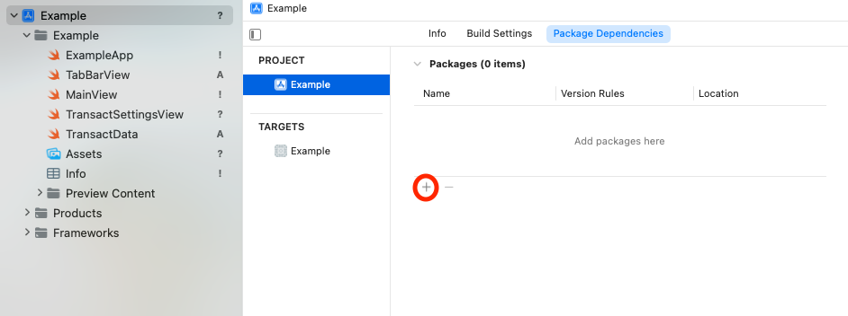

# Transact iOS SDK

The Atomic Transact iOS SDK is distributed using the Swift Package Manager. Inside Xcode, go Project Settings -> Project -> Package Dependencies and click the + to add a new Package. Enter the Package URL `https://github.com/atomicfi/TransactiOSSDK`. 



# Usage

To use Atomic Transact, create an instance of `AtomicConfig`. This object will help you setup and configure Transact. See the web docs for more information on each parameter: [https://docs.atomicfi.com/](https://docs.atomicfi.com/).

You will also need to provide a `TransactURL`. Use `.production` for any shipping applications, or `.sandbox` for development work. 

### UIKit Example

```Swift
import AtomicTransact

...

let config = AtomicConfig(publicToken: "MY PRODUCT TOKEN", product: .deposit)
Atomic.presentTransact(from: self, config: config, transactURL: .sandbox) { result in
	switch result {
	case .finished(let response):
		print("Finished with response: \(response)")
	case .closed(let response):
		print("Closed with response: \(response)")
	case .error(let error):
		print("Transact returned with error: \(error)")
	}
}

```


### SwiftUI Example

```Swift
import AtomicTransact

...

struct MyView: View {
	@State var showingTransact = false
	
    var body: some View {
		...
		.atomicTransact(
			isPresented: $showingTransact,
			config: AtomicConfig(publicToken: "MY PRODUCT TOKEN", product: .deposit),
			onCompletion: { result in
				switch result {
				case .finished(let response):
					print("Finished with response: \(response)")
				case .closed(let response):
					print("Closed with response: \(response)")
				case .error(let error):
					print("Transact returned with error: \(error)")
				}
			})

```